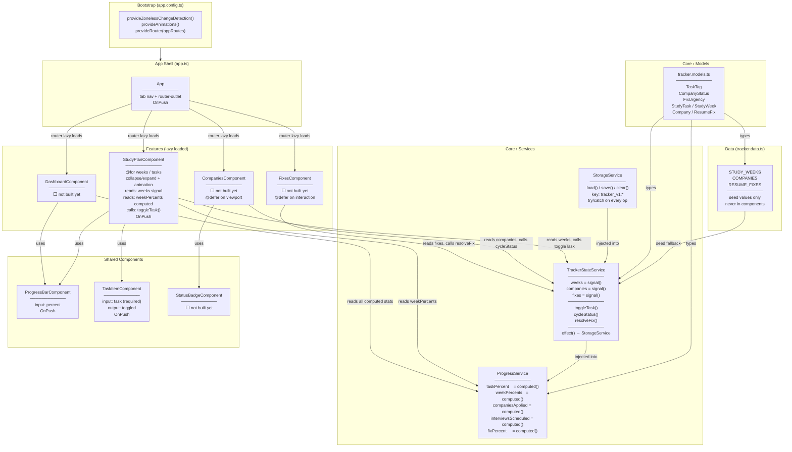
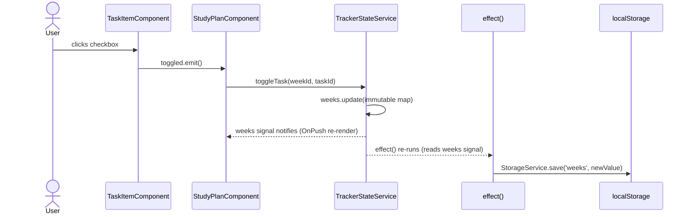
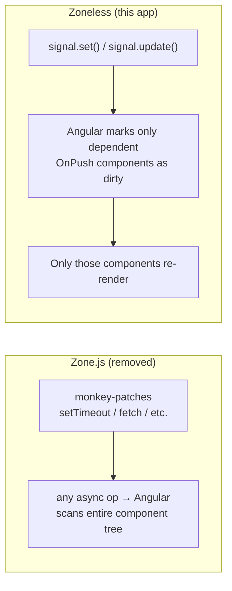
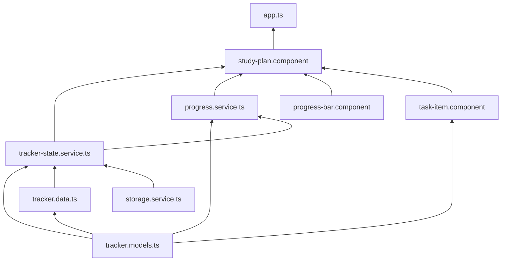

# Tracker App — Architecture

> Updated as each service and component is implemented.
> Last updated: Study Plan feature complete.

---

## Layer overview



---

## Data flow: what happens when a task is checked



---

## Change detection: why no Zone.js



---

## Dependency graph (no circular imports)



---

## File map

```
apps/tracker/src/app/
├── app.ts                          ← shell, tab nav, OnPush
├── app.config.ts                   ← zoneless + animations + router
├── app.routes.ts                   ← lazy routes per feature
│
├── core/
│   ├── models/
│   │   └── tracker.models.ts       ← enums + interfaces (no logic)
│   └── services/
│       ├── storage.service.ts      ← localStorage wrapper
│       ├── tracker-state.service.ts← signal() state + mutations
│       └── progress.service.ts     ← computed() derived stats
│
├── data/
│   └── tracker.data.ts             ← seed data (types only, no logic)
│
├── features/
│   ├── study-plan/                 ✅ built
│   ├── dashboard/                  ⬜ next
│   ├── companies/                  ⬜ pending
│   └── fixes/                      ⬜ pending
│
└── shared/
    └── components/
        ├── progress-bar/           ✅ built
        ├── task-item/              ✅ built
        └── status-badge/           ⬜ pending
```
